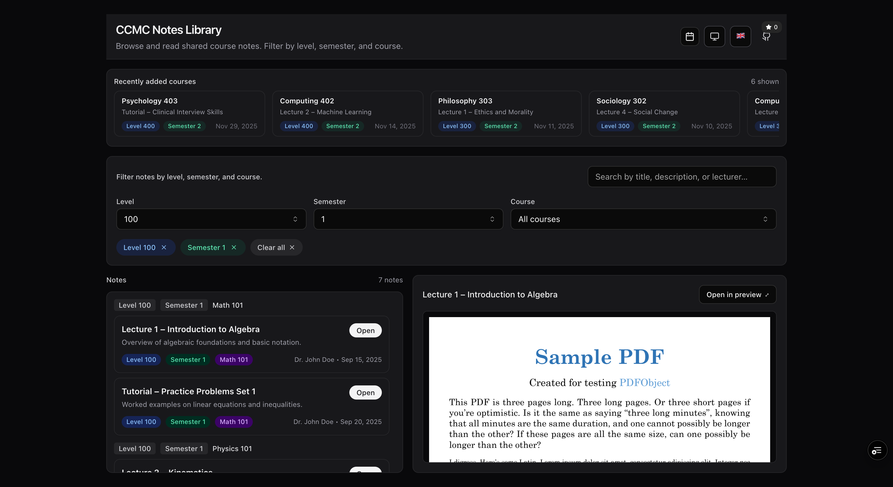
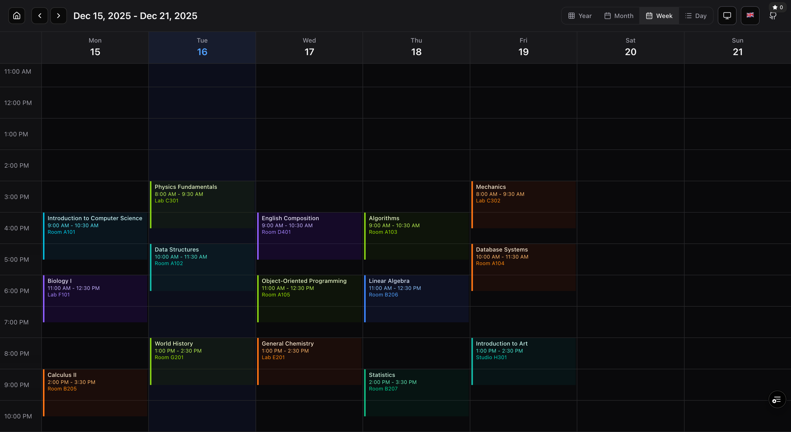
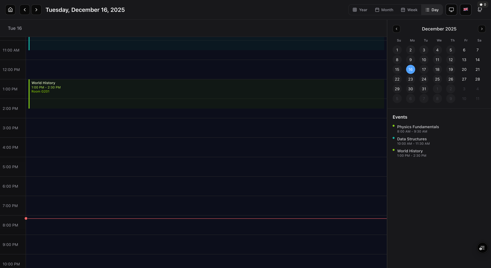
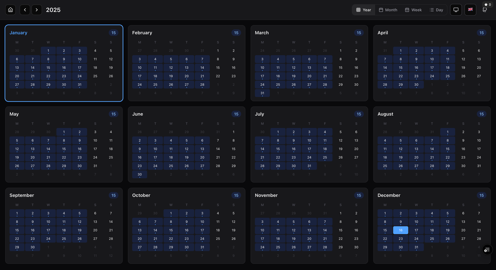
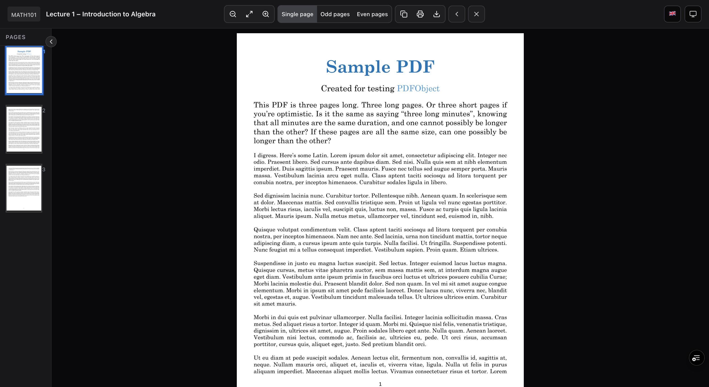

# CCMC Notes – Course Notes Library & Calendar

**CCMC Notes** is a comprehensive course-notes library and academic calendar built with **Next.js (App Router)**.  
It lets students:

- **Browse notes** grouped by **level**, **semester**, and **course**
- **Search** by title, description, or lecturer name
- **See recently updated courses** at a glance
- **Preview PDFs inline** (desktop) or open them in a dedicated preview page (mobile)
- **Manage class schedules** with a full-featured calendar (monthly, weekly, daily, and yearly views)
- **Add, edit, and delete timetable entries** directly from the calendar

Notes metadata is stored in a single JSON file (`public/notes.json`) and rendered on the main page.

---

## 🚀 Live Demo

[](https://ccmc-notes.vercel.app)

> **Note**: Replace the URL above with your actual deployment URL (Vercel, Netlify, etc.)

---

## 📸 Screenshots

### Home Page
<div align="center">
  
  <p><em>Desktop view of the notes library with filters, search, and recently added courses</em></p>
</div>

### Calendar Views
<div align="center">
  
  <p><em>Weekly calendar view with time slots and course schedules</em></p>
</div>

<div align="center">
  
  <p><em>Daily calendar view with detailed timetable, current time indicator, and sidebar with mini calendar and events list</em></p>
</div>

<div align="center">
  
  <p><em>Yearly calendar view showing all 12 months in a grid layout</em></p>
</div>

### PDF Viewer
<div align="center">
  
  <p><em>Full-featured PDF viewer with page thumbnails, navigation controls, and viewing options</em></p>
</div>

---

## 🛠️ Tech Stack

- **Framework**: Next.js 16 (App Router, TypeScript)
- **UI**: Tailwind CSS + Radix UI components
- **PDF Rendering**: `@embedpdf` for inline PDF viewing
- **State Management**: React hooks and context
- **Internationalization**: Custom i18n system (English & French)
- **Theme**: Dark/Light mode with system preference
- **Data Storage**: 
  - Notes: Static JSON (`public/notes.json`)
  - Calendar: LocalStorage (with IndexedDB support ready)

### Key Features

- **Feature-based Architecture**: Organized codebase following feature-based structure
- **Responsive Design**: Mobile-first approach with bottom sheets for mobile navigation
- **Accessibility**: ARIA labels, keyboard navigation, and screen reader support
- **Performance**: Optimized with React Server Components and client-side caching

---

## 🚀 Getting Started (Local Development)

### Prerequisites

- Node.js 18+ and npm
- Git

### Installation

1. **Clone the repository**:

   ```bash
   git clone https://github.com/yunweneric/ccmc_notes.git
   cd ccmc_notes
   ```

2. **Install dependencies**:

   ```bash
   npm install
   ```

3. **Run the development server**:

   ```bash
   npm run dev
   ```

4. **Open your browser**:

   Navigate to `http://localhost:3000`

---

## 📁 Project Structure

```
ccmc_notes/
├── app/                    # Next.js App Router pages
│   ├── page.tsx           # Home page (notes library)
│   ├── calendar/          # Calendar page
│   ├── preview/           # PDF preview page
│   └── api/               # API routes
├── components/            # Shared UI components
│   ├── ui/               # Base UI components (Button, Input, etc.)
│   ├── theme/            # Theme switcher
│   ├── language/         # Language switcher
│   └── github/           # GitHub button
├── lib/
│   ├── features/         # Feature-based modules
│   │   ├── courses/     # Notes library feature
│   │   ├── calendar/    # Calendar feature
│   │   ├── preview/     # PDF preview feature
│   │   └── i18n/        # Internationalization
│   └── shared/           # Shared utilities
├── public/
│   └── notes.json        # Notes data source
└── docs/
    └── screenshots/      # Application screenshots
```

---

## 📝 Notes Data Format

The app expects `public/notes.json` to be an **array of course groups**, each with a list of notes:

```json
[
  {
    "level": "100",
    "semester": "1",
    "course_code": "MATH101",
    "course": "Math 101",
    "notes": [
      {
        "title": "Lecture 1 – Introduction to Algebra",
        "description": "Overview of algebraic foundations and basic notation.",
        "lecturer_name": "Dr. John Doe",
        "added_date": "2025-09-15",
        "file_url": "https://example.com/some-pdf.pdf"
      }
    ]
  }
]
```

### Field Descriptions

- **`level`**: Academic level (e.g., `"100"`, `"200"`, etc.)
- **`semester`**: Semester number (e.g., `"1"`, `"2"`)
- **`course_code`**: Course code identifier (e.g., `"MATH101"`)
- **`course`**: Human-readable course name (e.g., `"Math 101"`)
- **`notes`**: Array of individual notes for that course
  - **`title`**: Note title
  - **`description`**: Brief description
  - **`lecturer_name`**: Lecturer/Professor name
  - **`added_date`**: ISO date string (e.g., `"2025-09-15"`)
  - **`file_url`**: Direct link to the PDF file

> **Important**: For inline viewing to work, `file_url` must point to a PDF that is accessible from the browser and not fully blocked by CORS. If inline loading fails, users can still click **"Open in new tab"** in the viewer.

---

## 🎯 Usage

### Notes Library

- **Filter by Level / Semester / Course** using the dropdowns (desktop) or bottom sheet (mobile)
- **Search** notes using the search input (matches on title, description, and lecturer name)
- **See recently added courses** in the "Recently added courses" section
- **Open a note**:
  - On **desktop**: Clicking **Open** shows the PDF inline in the right-hand viewer
  - On **mobile**: Clicking **Open** navigates to the `/preview` page for a focused PDF view

### Calendar

- **Switch views**: Use the view switcher to toggle between Month, Week, Day, and Year views
- **Navigate dates**: Use Previous/Next buttons or click on dates
- **Add schedule**: Click on empty time slots to add new class schedules
- **Edit/Delete**: Click on existing schedule blocks to edit or delete them
- **Mobile**: Use the bottom sheet to access calendar options and settings

---

## 🌍 Internationalization

The app supports multiple languages:

- **English** (default)
- **French** (Français)

Language can be switched via the language switcher in the header (desktop) or options bottom sheet (mobile).

---

## 🎨 Themes

The app supports three theme modes:

- **Light** - Light color scheme
- **Dark** - Dark color scheme  
- **System** - Follows system preference

Theme can be switched via the theme switcher in the header (desktop) or options bottom sheet (mobile).

---

## 🤝 Contributing

Contributions are welcome! This section explains how to add notes, tweak the UI, or improve functionality.

### Prerequisites

- Node.js 18+ and npm installed
- Basic familiarity with React / Next.js and TypeScript

### Setting Up a Dev Environment

1. **Fork** this repository (if contributing externally)
2. **Clone** your fork:

   ```bash
   git clone <your-fork-url>
   cd ccmc_notes
   ```

3. **Install dependencies**:

   ```bash
   npm install
   ```

4. **Run the dev server**:

   ```bash
   npm run dev
   ```

5. Make sure the app runs at `http://localhost:3000` without TypeScript or runtime errors

### Adding or Updating Notes

1. Open `public/notes.json`
2. Follow the existing structure:
   - To **add a new course**, add a new object to the top-level array
   - To **add a new note** to an existing course, append a new object to its `notes` array
3. Ensure:
   - `added_date` is a valid date string (e.g., `"2025-09-18"`)
   - `file_url` is a valid PDF link that can be opened in the browser
4. Save the file and verify in the browser that:
   - The course appears with the correct level/semester
   - The new note shows up and opens correctly in the viewer

### Coding Guidelines

- Use **TypeScript** types consistently
- Keep components **small and focused**
- Follow the **feature-based architecture** structure
- Prefer existing UI primitives in `components/ui`
- Follow existing **Tailwind CSS** style patterns and spacing
- Write **accessible** code with proper ARIA labels

### Making Changes

- For **UI changes**, update components in `lib/features/[feature]/presentation/`
- For **behavioral changes**, update hooks in `lib/features/[feature]/hooks/`
- For **data changes**, update services in `lib/features/[feature]/data/services/`

When you're done:

1. Run the dev server and test your changes manually
2. Ensure there are no TypeScript or console errors
3. Test on both desktop and mobile views

### Submitting a PR

1. Create a feature branch:

   ```bash
   git checkout -b feature/short-description
   ```

2. Commit your changes with a clear message:

   ```bash
   git commit -m "Add notes for CS 201 and improve PDF viewer error message"
   ```

3. Push and open a Pull Request:
   - Describe **what** you changed
   - Mention **how to test** it
   - Include screenshots or GIFs for UI changes if helpful

---

## 📄 License

This project is licensed under the MIT License - see the [LICENSE](LICENSE) file for details.

---

## 🙏 Acknowledgments

- Built with [Next.js](https://nextjs.org/)
- UI components inspired by [Radix UI](https://www.radix-ui.com/)
- PDF rendering powered by [@embedpdf](https://embedpdf.com/)
- Icons from [Lucide](https://lucide.dev/)

---

## 📞 Support

If you encounter any issues or have questions:

1. Check the [Issues](https://github.com/yunweneric/ccmc_notes/issues) page
2. Create a new issue with a detailed description
3. Include screenshots if applicable

---

<div align="center">
  <p>Made with ❤️ for students</p>
  <p>
    <a href="https://github.com/yunweneric/ccmc_notes">⭐ Star this repo</a> if you find it helpful!
  </p>
</div>
