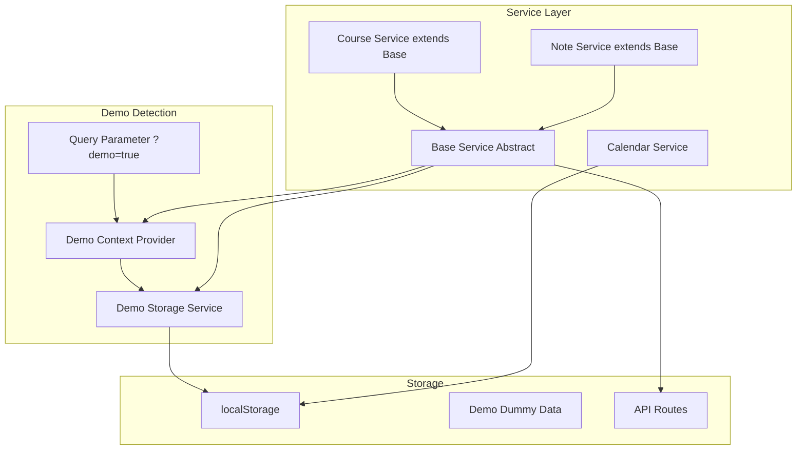

# Demo Mode Implementation

## Overview

Create a demo mode system that allows users to try the app without authentication. Demo mode uses dummy data, persists all changes in localStorage, and provides a reset option. This enables an open-source "try-it" experience.

## Architecture



## Implementation Steps

### 1. Demo Context and Detection

#### 1.1 Create Demo Context

**File**: `lib/features/demo/context/demo_context.tsx` (new file)

- Detect demo mode from query parameter `?demo=true`
- Provide `isDemoMode` boolean via context
- Provide `resetDemoData` function
- Store demo mode state in localStorage to persist across navigation

#### 1.2 Demo Storage Service

**File**: `lib/features/demo/data/services/demo_storage_service.ts` (new file)

- Centralized localStorage management for demo data
- Keys:
- `ccmc-demo-courses`: Courses data
- `ccmc-demo-notes`: Notes data (or merged with courses)
- `ccmc-demo-mode`: Demo mode flag
- `ccmc-demo-users`: Demo users data
- `ccmc-demo-current-user`: Currently logged in demo user
- Methods:
- `getCourses()`: Load courses from localStorage or return dummy data
- `saveCourses(courses)`: Save courses to localStorage
- `getNotes()`: Load notes from localStorage or return dummy data
- `saveNotes(notes)`: Save notes to localStorage
- `getUsers()`: Load demo users from localStorage or return default users
- `getCurrentUser()`: Get currently logged in demo user
- `setCurrentUser(user)`: Set currently logged in demo user
- `resetAll()`: Clear all demo data and restore defaults

### 2. Demo Data Generation

#### 2.1 Demo Data Generator

**File**: `lib/features/demo/data/generators/demo_data_generator.ts` (new file)

- Generate realistic dummy data:
- 10-15 course groups across different levels (100-500) and semesters
- 3-5 notes per course with varied titles, descriptions, lecturers
- Realistic course codes (MATH, CS, PHYS, CHEM, etc.)
- Sample PDF URLs (use existing sample PDF or placeholder)
- Include extended metadata (tags, file_size, file_type) for notes
- Generate unique IDs for all entities
- Generate demo users:
  - Admin user: `admin@demo.ccmc.edu` / `demo123` (or no password required in demo)
  - Regular user: `user@demo.ccmc.edu` / `demo123` (or no password required in demo)
  - Both users with proper `AuthUser` structure (uid, email, displayName, role)

### 3. Base Service Pattern

#### 3.1 Create Base Service

**File**: `lib/shared/services/base_service.ts` (new file)

- Abstract base class that all services extend
- Provides `isDemoMode()` method to check demo mode status
- Provides abstract methods for demo operations that child services implement:
- `listDemo()`: Load data from localStorage
- `createDemo(data)`: Save to localStorage
- `updateDemo(id, data)`: Update in localStorage
- `deleteDemo(id)`: Remove from localStorage
- Provides helper method `executeOperation()` that routes between demo and API:
- If demo mode: calls demo methods
- If not demo: calls API methods
- Handles common error patterns

#### 3.2 Refactor Course Service

**File**: `lib/features/courses/data/services/course_service.ts`

- Extend `BaseService` instead of standalone class
- Implement abstract demo methods (`listDemo`, `createDemo`, `updateDemo`, `deleteDemo`)
- Keep existing API methods as `listApi`, `createApi`, etc. (or use protected methods)
- Use `executeOperation()` pattern or override methods to call base class logic
- Maintain same public interface

#### 3.3 Refactor Note Service

**File**: `lib/features/notes/data/services/note_service.ts`

- Extend `BaseService` instead of standalone class
- Implement abstract demo methods (`listDemo`, `createDemo`, `updateDemo`, `deleteDemo`)
- Keep existing API methods
- Use base class pattern for demo mode detection
- Maintain same public interface

#### 3.4 Calendar Service

**File**: `lib/features/calendar/data/services/calendar_service.ts`

- Optionally extend `BaseService` for consistency
- Already uses localStorage, may not need changes
- Ensure it works seamlessly in demo mode

### 4. Demo Authentication

#### 4.1 Demo Auth Service

**File**: `lib/features/demo/data/services/demo_auth_service.ts` (new file)

- Handle authentication in demo mode
- Methods:
  - `login(email, password)`: Authenticate demo user (accepts demo credentials)
  - `logout()`: Clear current demo user
  - `getCurrentUser()`: Get currently logged in demo user from localStorage
  - `setCurrentUser(user)`: Set current demo user
- Accepts demo user credentials:
  - Admin: `admin@demo.ccmc.edu` / any password (or no password)
  - User: `user@demo.ccmc.edu` / any password (or no password)
- Returns `AuthUser` object matching the real auth structure
- Stores current user in localStorage: `ccmc-demo-current-user`

#### 4.2 Update Auth Service/Hook

**File**: `lib/features/auth/data/services/auth_service.ts` or create demo-aware wrapper

- Check if demo mode is active
- If demo mode: use `demoAuthService` instead of Firebase
- If not demo: use existing Firebase authentication
- Maintain same interface for both modes

### 5. API Route Modifications

#### 5.1 Update Courses API Routes

**Files**: `app/api/courses/route.ts`, `app/api/courses/[id]/route.ts`

- Check for demo mode (via query param or header)
- If demo mode: return demo data from localStorage (client-side only)
- Note: API routes run server-side, so demo mode should be handled client-side in services

**Alternative Approach**: Since API routes are server-side, demo mode should be handled entirely client-side in the services layer. API routes remain unchanged.

### 6. UI Components

#### 6.1 Demo Role Selection Page

**File**: `app/demo/page.tsx` (new file)

- Dedicated page for selecting demo role
- Route: `/demo` or `/demo/select`
- Beautiful UI with two cards/buttons:
  - "Login as Admin" card with admin icon and description
  - "Login as User" card with user icon and description
- Each card shows what features are available for that role
- On selection:
  - Auto-login with selected demo user
  - Set demo mode flag in localStorage
  - Redirect to home page or dashboard (based on role)
- Styled with modern, welcoming design
- Can be accessed via `/?demo=true` redirect or direct `/demo` route

#### 6.2 Demo Mode Banner

**File**: `lib/features/demo/presentation/components/demo_banner.tsx` (new file)

- Display banner at top of page when in demo mode
- Show "Demo Mode" indicator
- Include "Reset Demo Data" button
- Show current logged in user (if any)
- Include user switcher dropdown (switch between admin and regular user, or "Change Role" link)
- "Change Role" link redirects to `/demo` page
- Styled with distinct color (e.g., yellow/orange) to indicate demo state

#### 6.3 Reset Demo Dialog

**File**: `lib/features/demo/presentation/components/reset_demo_dialog.tsx` (new file)

- Confirmation dialog for resetting demo data
- Warns user that all changes will be lost
- Calls `resetDemoData` from context

#### 6.4 Demo User Switcher

**File**: `lib/features/demo/presentation/components/demo_user_switcher.tsx` (new file)

- Dropdown component to switch between demo users
- Options: "Admin User", "Regular User", "Change Role" (redirects to `/demo`)
- Updates current user in localStorage
- Triggers auth context update

### 7. Integration Points

#### 7.1 Root Layout Integration

**File**: `app/layout.tsx`

- Wrap app with `DemoProvider` context
- Conditionally render `DemoBanner` when in demo mode
- Handle redirect from `/?demo=true` to `/demo` page if no user selected

#### 7.2 Demo Page Route

**File**: `app/demo/page.tsx` (new file)

- Standalone page for role selection
- Accessible at `/demo` route
- Also accessible via `/?demo=true` redirect
- Handles role selection and auto-login
- Redirects to appropriate page after selection

#### 7.3 Dashboard Pages

**Files**: `app/dashboard/courses/page.tsx`, `app/dashboard/notes/page.tsx`

- In demo mode, check if user is logged in (via demo auth)
- If not logged in, redirect to `/demo` page
- If logged in as admin: allow full CRUD operations
- If logged in as user: show read-only view or redirect
- Show demo banner
- Use demo services instead of regular services

#### 7.4 Home Page

**File**: `app/page.tsx`

- Works in demo mode with demo data
- No changes needed if services handle demo mode
- If `?demo=true` and no user selected, redirect to `/demo`

### 7. Demo Mode Features

#### 7.1 Admin Features in Demo

- In demo mode, bypass authentication checks
- Allow all admin operations (create/edit/delete courses, notes)
- Show admin UI elements (add buttons, edit/delete actions)
- Store admin actions in localStorage

#### 7.2 Data Persistence

- All CRUD operations save to localStorage
- Data persists across page refreshes
- Data persists across navigation
- Reset button restores original dummy data

### 9. Demo Data Structure

#### 8.1 Courses Data

- Store in `localStorage` key: `ccmc-demo-courses`
- Format: Same as `CourseGroup[]` from `notes.json`
- Include all fields: level, semester, course_code, course, notes[]

#### 9.2 Notes Data

- Notes are part of courses, but can also be stored separately for easier management
- Store in same structure as courses (notes array within each course)
- Include extended metadata: id, tags, file_size, file_type, created_by, updated_date

#### 9.3 Users Data

- Store in `localStorage` key: `ccmc-demo-users`
- Format: Array of `AuthUser` objects
- Default users:
  ```typescript
  [
    {
      uid: "demo-admin-001",
      email: "admin@demo.ccmc.edu",
      displayName: "Demo Admin",
      photoURL: null,
      role: { name: Role.ADMIN, value: "admin" }
    },
    {
      uid: "demo-user-001",
      email: "user@demo.ccmc.edu",
      displayName: "Demo User",
      photoURL: null,
      role: { name: Role.USER, value: "user" }
    }
  ]
  ```

- Current user stored in: `ccmc-demo-current-user`

## Technical Details

### Demo Mode Detection

- Check URL query parameter: `?demo=true`
- Store flag in localStorage: `ccmc-demo-mode=true`
- Check localStorage on app initialization
- Context provides `isDemoMode` throughout app

### Base Service Pattern

```typescript
// Base Service (abstract)
abstract class BaseService {
  protected isDemoMode(): boolean {
    if (typeof window === 'undefined') return false;
    const stored = localStorage.getItem('ccmc-demo-mode');
    const urlParam = new URLSearchParams(window.location.search).get('demo');
    return stored === 'true' || urlParam === 'true';
  }

  protected abstract listDemo(): Promise<{ data: any[]; error: Error | null }>;
  protected abstract createDemo(data: any): Promise<{ data: any | null; error: Error | null }>;
  protected abstract updateDemo(id: string, data: any): Promise<{ data: any | null; error: Error | null }>;
  protected abstract deleteDemo(id: string): Promise<{ error: Error | null }>;
}

// Course Service extends Base
class CourseService extends BaseService {
  async list() {
    if (this.isDemoMode()) {
      return this.listDemo();
    }
    return this.listApi();
  }

  protected async listDemo() {
    // Load from localStorage via demoStorageService
  }

  protected async listApi() {
    // Existing API call
  }
}
```

### LocalStorage Keys

- `ccmc-demo-mode`: Boolean flag
- `ccmc-demo-courses`: JSON string of CourseGroup[]
- `ccmc-demo-users`: JSON string of AuthUser[] (demo users)
- `ccmc-demo-current-user`: JSON string of AuthUser (currently logged in)
- `ccmc-demo-calendar`: Already exists as `ccmc-calendar-schedules`

### Reset Functionality

- Clear all demo-related localStorage keys
- Regenerate and store fresh dummy data
- Refresh page or update state to reflect reset

## Files to Create

1. `lib/shared/services/base_service.ts` - Abstract base service class
2. `lib/features/demo/context/demo_context.tsx`
3. `lib/features/demo/data/services/demo_storage_service.ts`
4. `lib/features/demo/data/services/demo_auth_service.ts` - Demo authentication service
5. `lib/features/demo/data/generators/demo_data_generator.ts`
6. `app/demo/page.tsx` - Demo role selection page
7. `lib/features/demo/presentation/components/demo_banner.tsx`
8. `lib/features/demo/presentation/components/reset_demo_dialog.tsx`
9. `lib/features/demo/presentation/components/demo_user_switcher.tsx` - User switcher component
10. `lib/features/demo/presentation/components/demo_role_selection.tsx` - Role selection UI component (optional, if extracting from page)
11. `lib/features/demo/index.ts`

## Files to Modify

1. `app/layout.tsx` - Add DemoProvider and DemoBanner
2. `lib/features/courses/data/services/course_service.ts` - Extend BaseService, implement demo methods
3. `lib/features/notes/data/services/note_service.ts` - Extend BaseService, implement demo methods
4. `lib/features/calendar/data/services/calendar_service.ts` - Optionally extend BaseService (if needed)
5. `lib/features/auth/data/services/auth_service.ts` - Add demo mode check, use demoAuthService when in demo
6. `lib/features/auth/hooks/use_auth.ts` - Support demo mode authentication
7. `app/dashboard/courses/page.tsx` - Bypass auth in demo mode (or use demo user)
8. `app/dashboard/notes/page.tsx` - Bypass auth in demo mode (or use demo user)
9. `app/dashboard/page.tsx` - Bypass auth in demo mode (if needed)
10. `app/page.tsx` - Ensure it works with demo mode

## Dependencies

- Existing: localStorage API (browser built-in)
- No new npm packages needed

## Demo Data Examples

### Sample Course

```json
{
  "level": "200",
  "semester": "1",
  "course_code": "CS201",
  "course": "Data Structures and Algorithms",
  "notes": [
    {
      "id": "cs201-lecture1-2025-01-15",
      "title": "Lecture 1 - Introduction to Data Structures",
      "description": "Overview of arrays, linked lists, and basic operations.",
      "lecturer_name": "Prof. Sarah Johnson",
      "added_date": "2025-01-15",
      "updated_date": "2025-01-15",
      "tags": ["lecture", "data-structures", "fundamentals"],
      "file_url": "https://ontheline.trincoll.edu/images/bookdown/sample-local-pdf.pdf",
      "file_size": 2048576,
      "file_type": "application/pdf",
      "course_id": "200-1-CS201"
    }
  ]
}
```

## User Experience

1. User visits `/?demo=true`
2. Demo banner appears at top
3. Demo users are automatically seeded in localStorage
4. User can login with demo credentials:

   - Admin: `admin@demo.ccmc.edu` / any password
   - Regular user: `user@demo.ccmc.edu` / any password

5. User can switch between demo users using the user switcher in the banner
6. User can browse, create, edit, delete courses and notes (based on role)
7. All changes persist in localStorage
8. User can click "Reset Demo" to restore original dummy data and reset users
9. Demo mode persists across navigation (stored in localStorage)
10. User can exit demo mode by removing query param and clearing localStorage

## Demo User Credentials

Demo mode provides two pre-configured accounts (no password required):

- **Admin Account**:
  - Email: `admin@demo.ccmc.edu`
  - Role: Admin
  - Access: Full access to all dashboard features (create, edit, delete courses and notes)
  - Features: Can manage courses, notes, calendar, and all admin functions

- **Regular User Account**:
  - Email: `user@demo.ccmc.edu`
  - Role: User
  - Access: Read-only access to courses and notes
  - Features: Can view courses, notes, and calendar (no editing capabilities)

**Note**: Users select their role on the `/demo` page - no password authentication required in demo mode.